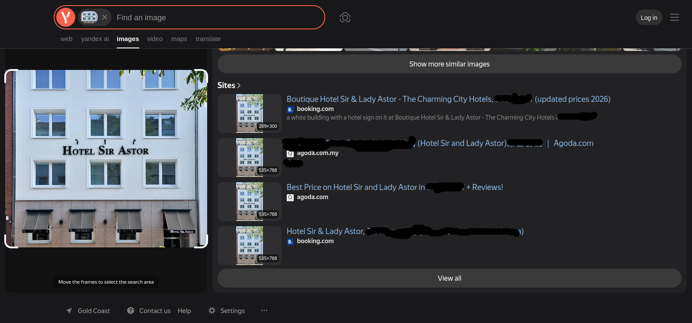
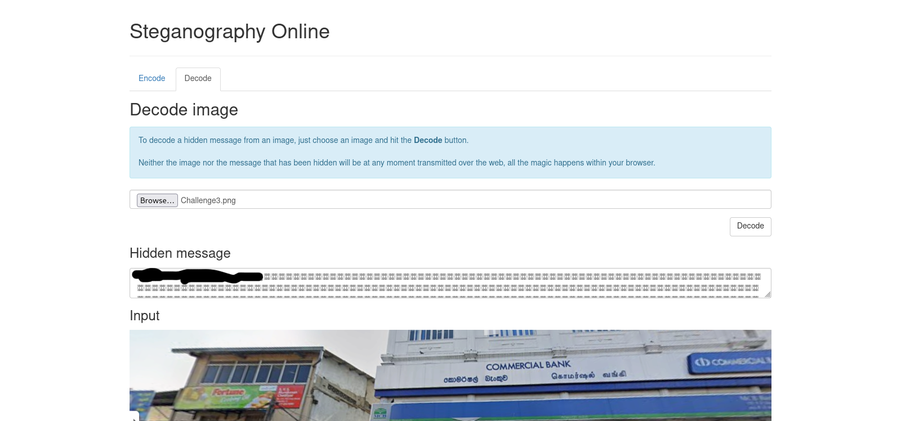

# Locate-THM

In this room you will test your steganography, metadata and location skillset.

You can find the room [here](https://tryhackme.com/room/locate)

## Challenge 1

to extract the metadata i ran this command:
```sh
$ exiftool Challenge1.png
ExifTool Version Number         : 13.55
File Name                       : Challenge1.png
Directory                       : .
File Size                       : 552 kB
File Modification Date/Time     : 2026:07:11 02:38:00-04:00
File Access Date/Time           : 2026:07:11 02:38:01-04:00
File Inode Change Date/Time     : 2026:07:11 02:38:00-04:00
File Permissions                : -rw-rw-r--
File Type                       : PNG
File Type Extension             : png
MIME Type                       : image/png
Image Width                     : 994
Image Height                    : 653
Bit Depth                       : 8
Color Type                      : RGB
Compression                     : Deflate/Inflate
Filter                          : Adaptive
Interlace                       : Noninterlaced
SRGB Rendering                  : Relative Colorimetric
Pixels Per Unit X               : 2835
Pixels Per Unit Y               : 2835
Pixel Units                     : meters
Author                          : THM{_______________}
Image Size                      : 994x653
Megapixels                      : 0.649
```
and we can see that the flag is in the author field

Next i went to yandex to do a reverse image search
</img>

# Challenge 2

This challenge has no hidden flags and is purely a image location task.

i used yandex to find the city but i had to scroll down to find the city name in the links
</img>

# Challenge 3

This image has a flag hidden in it.

We got lucky with a metadata search last time so ill try that this time.

```sh
$ exiftool Challenge3.png
ExifTool Version Number         : 13.55
File Name                       : Challenge3.png
Directory                       : .
File Size                       : 901 kB
File Modification Date/Time     : 2026:07:11 18:34:17-04:00
File Access Date/Time           : 2026:07:11 18:35:02-04:00
File Inode Change Date/Time     : 2026:07:11 18:34:17-04:00
File Permissions                : -rw-rw-r--
File Type                       : PNG
File Type Extension             : png
MIME Type                       : image/png
Image Width                     : 1534
Image Height                    : 464
Bit Depth                       : 8
Color Type                      : RGB with Alpha
Compression                     : Deflate/Inflate
Filter                          : Adaptive
Interlace                       : Noninterlaced
Image Size                      : 1534x464
Megapixels                      : 0.712
```

we can see from above that there is no metadata flag.

the next thing that we can try is steganography.

we can see that this is a png file so steghide wont support it.

i found a online steganography tool that you can access [here](https://stylesuxx.github.io/steganography/)

</img>
